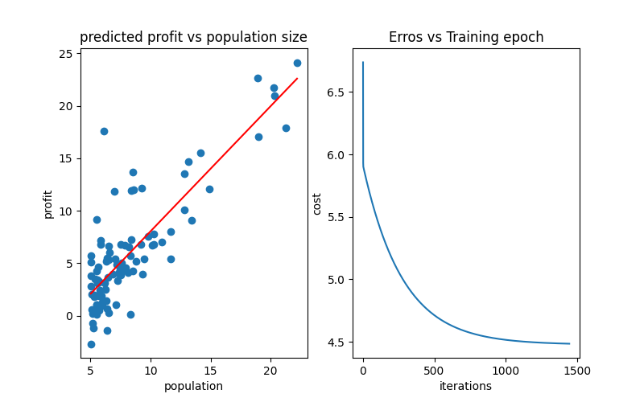

# Single Linear Regression -- from scratch & Sklearn
this project implements linear regression based on single variable ( population size )
to predict output ( profit )

## Features
- Data preprocessing and displays the data
- calculate  mathimatically cost function and gradient descent
- setup iterations to stop if the cost function decreases a too little
- drawing graph for profits vs population size
- predicting by sklearn a new profit value based on population size
- displays a graph for profits vs population size and a graph for cost function vs iterations by sklearn

## Dataset Structure
- the model trains on two column dataset ('data_single_var.txt')
- ** population **: the size of the city population ( independent variable X )
- ** profit *: the profit of that city ( dependent variavle y )

## implementation Details
- reading the data , naming the columns and Skipinit so that any spaces in data it removes
- convert data to numeric values so that any npn-numeric values are turned into Nan
- show the data and its description to ensure it's appropriate and has no missing values
- add one's column
- divide the data into inputs and outputs
- seperate features for sklearn ( before converting them into matrix) 
- converting the data into matrix and make theta

### implementation cost function
- implement cost function manually to measure how well prediction line fits training data
- def compute_cost( X , y , theta) : 
- mathimatically equation = 1 / ( 2 * m ) * sum( ( predicted value - actual value )^2 )
- m = number of training data

### implementation gradient descent
-  implement gradient descent manually to guess thetas and decrease cost function
-  Instead of guessing the weights or using exhaustive searching
-  Gradient Descent calculates the partial derivative (the slope) of the cost function.
-  This tells the model exactly which direction to move its parameters and by how much,
-  ensuring that with each epoch, the prediction error decreases until it reaches the global minimum.

- if i > 0 and abs ( cost[i - 1] - cost[i] ) < 0.00003 :
- setup iteration when the cost fun decreases a too little it stops iterations at alpha = 0.01
- drawing predicted profit vs population size by traditional way
- x = the start and end point for regression line
- f = equation of linear regression ( expected values )

### predicting by SKlearn
- lin_reg is a object from LinearRegression class
- `fit()` method ( and out manual gradient ) represents the actual training phase of ML model
- it takes input features and target labels to iteratuvely adjust the parameters ( theta1 , theta2 )
- it optimizes thetas until cost function reaches into the global minimam
- establish the best regression line fits the data

`predict()` method takes inputs ( test data ) and produces the predicted values based on regression line

### drawing by sklearn
 - draw a graph for predicted profit vs population size
 - draw a graph for Cost function vs iterations

## Results
- Cost before gradient = 32.072733877455676 
- Cost after gradient = 4.4846848047288494 
- Cost = [6.73719046 5.93159357 5.90115471 ... 4.48476876 4.48474067 4.48471269]
- Number of iterations = 1448
- theta after gradient = [[-3.60470313  1.16379173]]
- predicted profit for 70k people = 44554.55
- predicted profit for 10k people = -27027.47
- predicted profit for 40k people = 8763.54

## Visualization
the figure below shows the fitted regression line on the training data ( left )
and the cost function vs iterations ( right )

